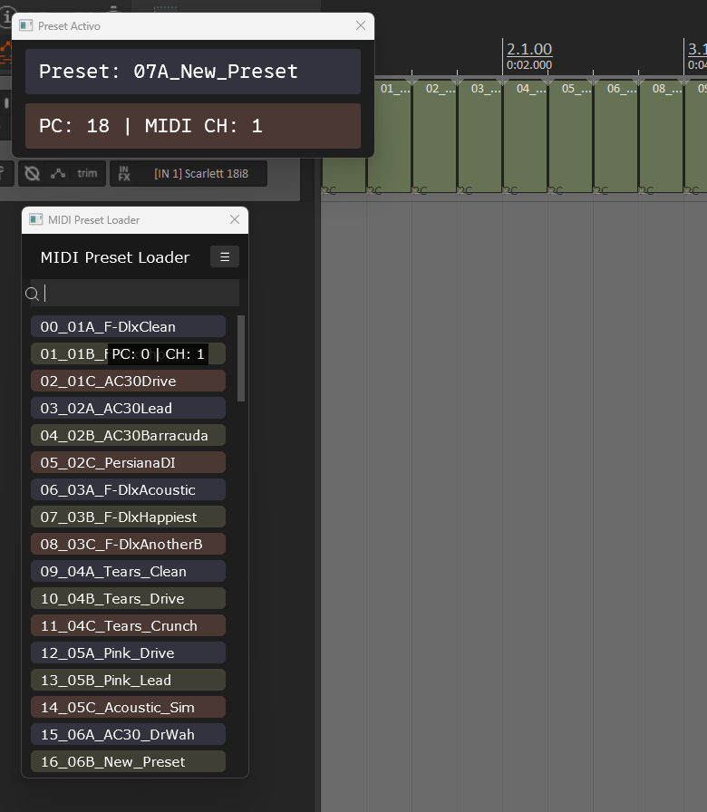

# MIDI Preset Tools for REAPER

This repository contains two Lua scripts for REAPER, designed to simplify working with **MIDI presets** in live performance, composition, or external synth control contexts.

---

## 🎛️ Real-world Use Case

*Ideally, this tool is independent of the gear you're using — simply placing your `.mid` files (with the appropriate PC and CH) into different folders should be enough for the loader and visualizer to work seamlessly with your DAW timeline.*

This project was born out of a practical need for a smooth and efficient workflow during live shows:

1. On stage, I use an **MLive Bbeat** as a sequence trigger. This device can launch audio and MIDI sequences simultaneously. Combined with a **WIDI wireless MIDI transmitter**, I send MIDI instructions wirelessly to my **HX STOMP (Line 6)** so it automatically changes presets during a performance.

2. The challenge is that REAPER is not very user-friendly for this kind of fine-tuning. Making precise preset change adjustments requires opening the MIDI editor, viewing the event list, and manually managing timing, which is tedious and error-prone.

3. To solve this, I created a collection of individual `.mid` files — each containing a specific `Program Change` (PC) and `Channel (CH)` message to instruct my gear.

These tools make full use of those MIDI files, organizing them into a loader and a real-time visualizer to simplify and enhance live MIDI preset control directly within REAPER.

---

## 🎯 Included Scripts

### 1. `MIDI_Preset_Loader.lua`
An interactive visual panel for selecting and inserting MIDI files as presets.

- Lists all `.mid` files in a configurable folder.
- Allows name-based search.
- Inserts the MIDI file into the selected track.
- Shows a tooltip with detected `Program Change` (PC) and channel (CH) when hovering over a file.

**Ideal for:** using MIDI clips as preconfigured patch or preset changes.

---

### 2. `MIDI_Preset_Indicator.lua`
A visual indicator that detects `Program Change` MIDI events in real time during playback.

- Displays the active preset name (from the MIDI file name).
- Also shows the `PC` number and MIDI `channel`.
- Includes a visual glow effect when the preset changes.
- Stays on screen with the last detected preset.

**Ideal for:** live performance monitoring, on-stage feedback, or debugging automated changes.

---

## ⚙️ Requirements
- REAPER (recommended v6.7 or newer)
- SWS Extension (recommended for best script support)

---

## ⚡ Installation
1. Clone this repository or download it as a ZIP.
2. Place the scripts in a folder of your choice.
3. In REAPER:
   - Open the Action List (`?` or `Actions > Show Action List`).
   - Click "Load..." and select the `.lua` script you want to use.
   - Optionally assign a shortcut for quick access.

---

## 👀 Example Workflow

1. Use `MIDI_Preset_Loader.lua` to insert a `.mid` file into the desired track.
2. Run `MIDI_Preset_Indicator.lua` in a floating window to monitor preset changes.
3. During playback, you will see the active preset name in real time.

---

## ✏️ Customization
- You can modify the presets folder in the loader by editing the automatically generated INI file.
- Recommended MIDI file name format: `34_PianoPad.mid` for easy PC mapping.
- Ideally, this tool is independent of the gear you're using — simply placing your `.mid` files (with the appropriate PC and CH) into different folders should be enough for the loader and visualizer to work seamlessly with your DAW timeline.

---

## 📊 Status & Future
These scripts are actively evolving. If you have suggestions, improvements, or bug reports, feel free to open an issue or pull request.

---

## ✉️ Contact
Created with passion for technical musicians.
Reach out to the original author (you!) via this repository or on GitHub.

---

**✨ Play freely while your presets handle themselves.**
